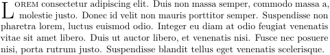
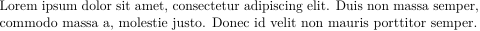
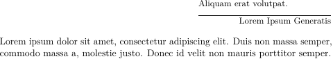
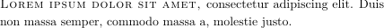
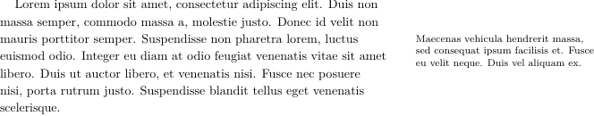
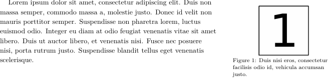

pandoc-latex-extensions 0.1.0
=============================

*pandoc-latex-extensions* is a [pandoc] filter that adds latex extensions.

Bug reports and feature requests may be posted on the project's [Issues tracker].  If you find pandoc-latex-extensions useful, then please kindly give it a star [on GitHub].

Plugin contributions are welcome.  See [Development](#development).

See also: [pandoc-fignos], [pandoc-eqnos], [pandoc-tablenos]

[pandoc]: http://pandoc.org/
[Issues tracker]: https://github.com/tomduck/pandoc-latex-extensions/issues
[on GitHub]:  https://github.com/tomduck/pandoc-latex-extensions
[pandoc-fignos]: https://github.com/tomduck/pandoc-fignos
[pandoc-eqnos]: https://github.com/tomduck/pandoc-eqnos
[pandoc-tablenos]: https://github.com/tomduck/pandoc-tablenos

Contents
--------

 1. [Installation](#installation)
 2. [Usage](#usage)
 3. [Markdown Syntax](#markdown-syntax)
 4. [Development](#development)

Installation
------------

Pandoc-latex-extensions requires [python], a programming language that comes pre-installed on macOS and linux.  It is easily installed on Windows -- see [here](https://realpython.com/installing-python/).

Pandoc-latex-extensions may be installed and upgraded using the shell command

    pip install pandoc-latex-extensions --user --upgrade

Pip is a program that downloads and installs software from the Python Package Index, [PyPI].  It normally comes installed with a python distribution.[2](#footnote1)

[python]: https://www.python.org/
[PyPI]: https://pypi.python.org/pypi
[README.developers]: README.developers

Usage
-----

Pandoc-latex-extensions is activated by using the

    --filter pandoc-latex-extensions

option with pandoc.

Extensions
----------

The following extensions are enabled.  Options for each extension will be implemented on request.

### newpage ###

Synopsis: Converts pandoc [horizontal rules](https://pandoc.org/MANUAL.html#horizontal-rules) to `\newpage` commands.

### lettrine ###

Synopsis: Converts pandoc [spans](https://pandoc.org/MANUAL.html#divs-and-spans) of class `lettrine` to `\lettrine` commands.

Installs: The [lettrine](https://www.ctan.org/pkg/tufte-latex) package.

Example:

~~~markdown
[Lorem ipsum dolor sit amet,]{.lettrine} consectetur adipiscing elit. Duis non massa semper, commodo massa a, molestie justo. Donec id velit non mauris porttitor semper. Suspendisse non pharetra lorem, luctus euismod odio. Integer eu diam at odio feugiat venenatis vitae sit amet libero. Duis ut auctor libero, et venenatis nisi. Fusce nec posuere nisi, porta rutrum justo. Suspendisse blandit tellus eget venenatis scelerisque.
~~~

### noindent ###

Synopsis: Removes indentation from the content of pandoc [divs](https://pandoc.org/MANUAL.html#divs-and-spans) with class `noindent`.

Example:

~~~markdown
::: {.noindent}
Lorem ipsum dolor sit amet, consectetur adipiscing elit. Duis non massa semper, commodo massa a, molestie justo. Donec id velit non mauris porttitor semper.
:::
~~~

### epigraph ###

Synopsis: Converts pandoc [divs](https://pandoc.org/MANUAL.html#divs-and-spans) with class `epigraph` to `\epigraph` commands.

Installs: The [epigraph](https://ctan.org/pkg/epigraph) package.

Example:

~~~markdown
::: {.epigraph}
Aliquam erat volutpat.

Lorem Ipsum Generatis
:::

Lorem ipsum dolor sit amet, consectetur adipiscing elit. Duis non massa semper, commodo massa a, molestie justo. Donec id velit non mauris porttitor semper.
~~~

The last line in the div is taken to be the quote author.  There must be a blank line above it.

Indentation is removed from the first paragraph after the epigraph.

### newthought ###

Synopsis: Converts pandoc [spans](https://pandoc.org/MANUAL.html#divs-and-spans) with class `newthought` to [tufte-latex](https://www.ctan.org/pkg/tufte-latex) `\newthought` commands.

Requires: The [documentclass](https://pandoc.org/MANUAL.html#variables-for-latex) must be `tufte-book` or `tufte-handout`.

Example:

~~~markdown
---
 documentclass: tufte-handout
...

[Lorem ipsum dolor sit amet,]{.newthought} consectetur adipiscing elit. Duis non massa semper, commodo massa a, molestie justo.
~~~

### marginnote ###

Synopsis: Converts pandoc [divs](https://pandoc.org/MANUAL.html#divs-and-spans) with class `marginnote` to [tufte-latex](https://www.ctan.org/pkg/tufte-latex) `\marginnote` commands.

Requires: The [documentclass](https://pandoc.org/MANUAL.html#variables-for-latex) must be `tufte-book` or `tufte-handout`.

Options: `offset`.

Example:

~~~markdown
---
 documentclass: tufte-handout
...

Lorem ipsum dolor sit amet, consectetur adipiscing elit. Duis non massa semper, commodo massa a, molestie justo. Donec id velit non mauris porttitor semper. Suspendisse non pharetra lorem, luctus euismod odio. Integer eu diam at odio feugiat venenatis vitae sit amet libero. Duis ut auctor libero, et venenatis nisi. Fusce nec posuere nisi, porta rutrum justo. Suspendisse blandit tellus eget venenatis scelerisque.

::: {.marginnote offset=-2cm}
Maecenas vehicula hendrerit massa, sed consequat ipsum facilisis et. Fusce eu velit neque. Duis vel aliquam ex.
:::
~~~

### marginfigure ###

Synopsis: Converts pandoc [implicit figures](https://pandoc.org/MANUAL.html#implicit_figures) with class `marginfigure` to [tufte-latex](https://www.ctan.org/pkg/tufte-latex) `marginfigure` environments.

Requires: The [documentclass](https://pandoc.org/MANUAL.html#variables-for-latex) must be `tufte-book` or `tufte-handout`.

Options: `offset`.

Example:

~~~markdown
---
 documentclass: tufte-handout
...

Lorem ipsum dolor sit amet, consectetur adipiscing elit. Duis non massa semper, commodo massa a, molestie justo. Donec id velit non mauris porttitor semper. Suspendisse non pharetra lorem, luctus euismod odio. Integer eu diam at odio feugiat venenatis vitae sit amet libero. Duis ut auctor libero, et venenatis nisi. Fusce nec posuere nisi, porta rutrum justo. Suspendisse blandit tellus eget venenatis scelerisque.

{.marginfigure offset=-2cm}
~~~

Development
-----------

Pandoc-latex-extensions is a [pandoc filter](https://pandoc.org/filters.html).  It is written in python, and so uses the [pandocfilters](https://github.com/jgm/pandocfilters) module. [Pandocxnos](https://github.com/tomduck/pandocxnos) provides additional support.

The `pandoclatex/core.py` module provides common infrastructure for each extension.

Extensions are implemented as plugins.  Installing a new plugin is as easy as dropping it into `pandoclatex/plugins`.

Plugins may define `action(key, value, fmt, meta)` and `processor(meta, blocks)` functions.  These are automatically detected and called by `pandoclatex/core.py`.

The `action(...)` functions are applied to each element in a pandoc document's abstract syntax tree.  As per the [pandocfilters](https://github.com/jgm/pandocfilters) documentation,

* `key` is the type of the pandoc object (e.g. 'Str', 'Para');
* `value` is the contents of the object (e.g. a string for 'Str', a
  list of inline elements for 'Para')
* `format` is the target output format (as supplied by the format
   argument of walk)
* `meta` is the document's metadata

Processors process document `meta`data and content `blocks`.  These are used mostly for injecting LaTeX into the document `meta`data.  Block processing can also be performed, although `action(...)` is generally preferred.

The best way to write a new filter is to adapt an existing filter that does something close to what is desired.

----

**Footnotes**

<a name="footnote1">1</a>: Anaconda users may be tempted to use `conda` instead.  This is not advised.  The packages distributed on the Anaconda cloud are unofficial, are not posted by me, and in some cases are ancient.  Some tips on using `pip` in a `conda` environment may be found [here](https://www.anaconda.com/using-pip-in-a-conda-environment/).
